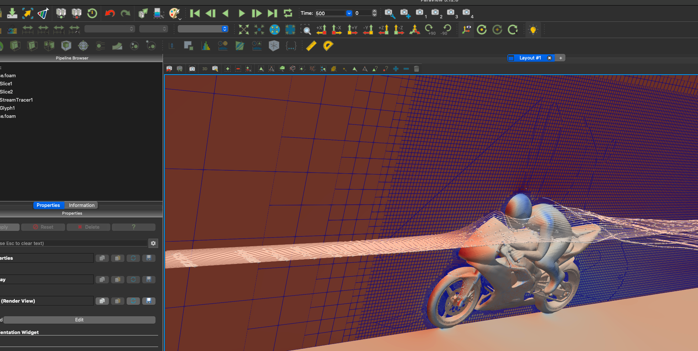

### 4. Run MPI application (OpenFOAM) via Azure CLI


Download bash script:

```
git clone@https://github.com/marconetto/2024hpcsummitv1.git
cd 2024hpcsummitv1/batchmpicli
```

Run executable:

```
./batch_openfoam.sh -g myresourcegroup
```

Copy the task results to local machine via ``scp`` to jumpbox VM, ``azcopy``, or
[Azure Storage Explorer ](https://azure.microsoft.com/en-us/products/storage/storage-explorer).

```
azcopy login
azcopy copy <Blob SAS URL> "mydata"
```


Delete resource groups:

```
az group delete -g myresourcegroup
```

Visualize the results with paraview. Link to [download](https://www.paraview.org/download/).


<p align="center" width="100%">
   
</p>

